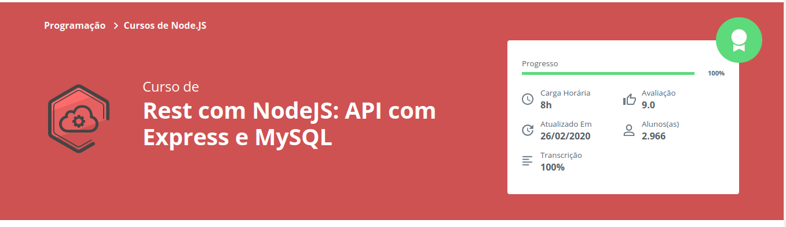
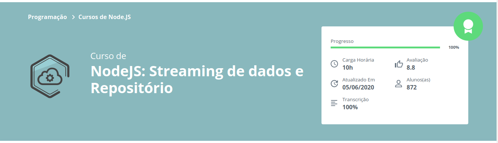

# Curso de NodeJs: Alura
Repositório criado para acompanhar e implementar técnicas aprendidas no curso de Nodejs da Alura

## Conhecimentos Adquiridos
- [x] Criação de API REST
- [x] Integração com Banco de Dados (MySql)
- [x] Armazenamento de arquivos em banco
- [x] Separar código por Responsabilidade
- [x] Aplicação do padrão de repositórios no projeto

## Cursos Implementados
[Rest com NodeJs](https://cursos.alura.com.br/course/node-rest-api)

[NodeJs: Stream de dados](https://cursos.alura.com.br/course/nodejs-streaming-dados)
